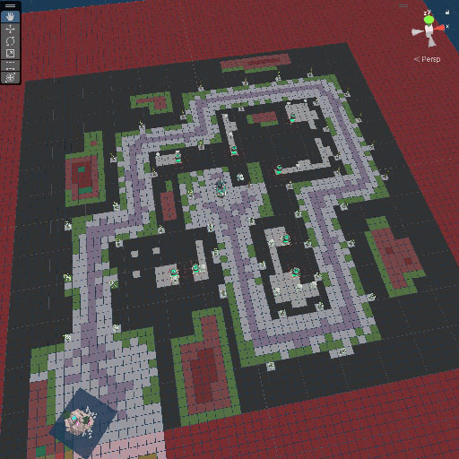
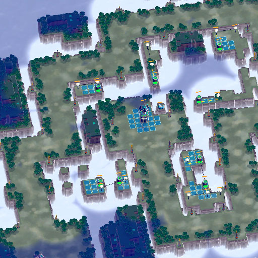

## Map Generator.

This is a simplified version of the map generator used in the game Brace the Swarm. The map exported from this algorithm can be used 'as is' in the game.
### How to use.

Clone repo to desired location.
```
git clone git@github.com:GlennNygard/map_generator.git
```

Open cloned repo then run the cmake build commands.
```
cmake -B build -S .
```
```
cmake --build build --target map_generator
```

This will fetch any required 3rd party libraries and build the project.

Run the map generator from the build/ directory. From the root directory, just run:
```
./build/bin/map_generator
```

Some parameters, like the total count of maps created as well as their size, can be modified through the command line arguments.
```
map_generator --filename "MyCoolMap"
map_generator --count 5
map_generator --size medium
```

See a list of all possible arguments with:
```
map_generator --help
```


If the map size and map complexity is set high enough, **the map generation might take a very long time or even fail**. Failure is an expected part of many constraint-solving algorithms, especially when using large input sets like here. In most cases the algorithm will automatically try again if it fails.


### Outputs.

The outcome of the algorithm should look a little like the map presented below.



Keep in mind that exact node colours will be a bit different. The exported thumbnails can be seen in the folder below after the program has run.

```
output/thumbnails
```

The maps themselves will be in the format .txt and stored in:
```
output/maps
```


There is no real way of visualising the map right now, so this is purely serves as a way to explore the algorithm for the fun of it.

When visualised in the game Brace the Swarm, the generated maps would look something like this



BTS uses a more complex version of this algorithm for its internal map creation, and maps from this generator can be used as is for the game.
In the future, I might get around to creating a public way of displaying and interacting with the maps generated as well.


### Current shortcomings.

There are some aspects that will slow down the algorithm, such as the size of the input set (which accounts for almost 150 different elements). Reducing this will dramatically decrease the amount of calculations needed to solve a given section of the map, and heavily reduce the likelihood of the generation process failing.

Without reductions, expect the generation to take anywhere from 5-100+ seconds per map depending on hardware and map size.

While the memory concerns and layout during runtime is currently ok for the most part, there's still a lot that can be done here by reducing the space needed for various components and store them in a more efficient manner.

Some of these optimisations already exists in the game version of this algorithm, and will hopefully make their way here as well.

The final outputs are in a simple and readable .txt file. The upsides with this is that debugging (if you know the file layout) and simple modifications are very easy. The main downside is the space requirements. It is therefore important that files are compressed before use.
